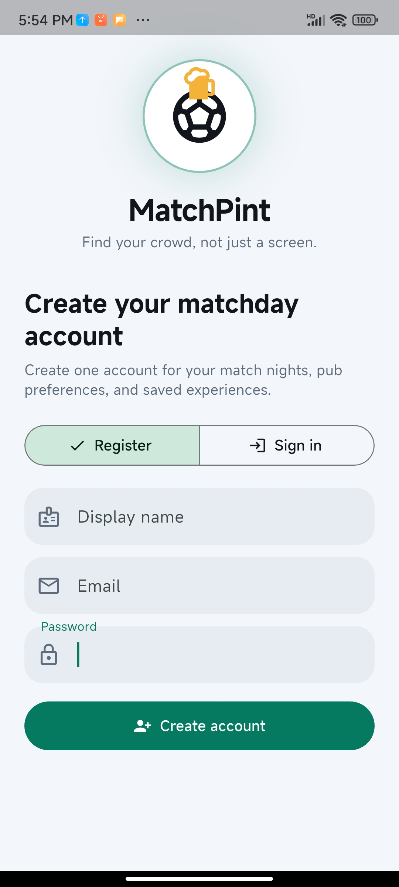
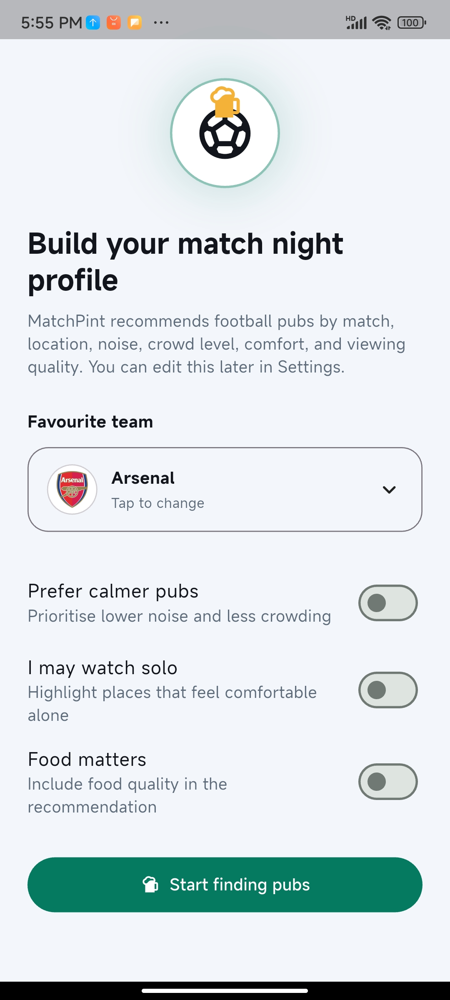
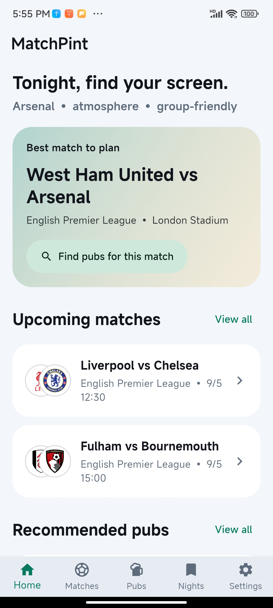
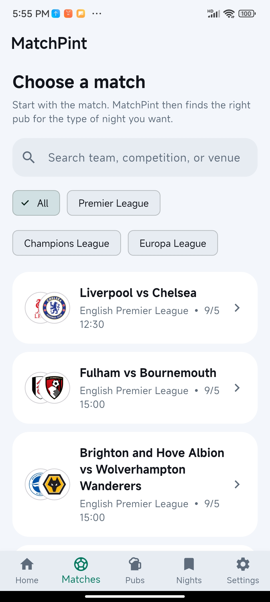
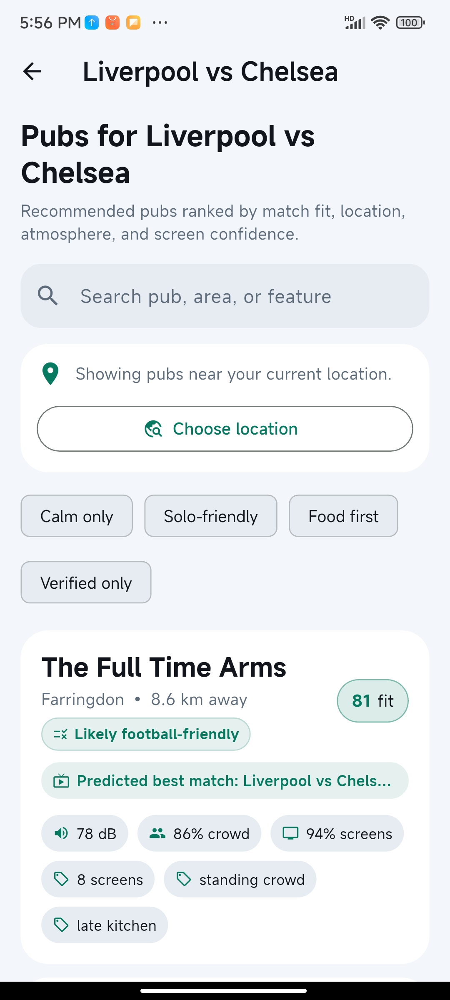
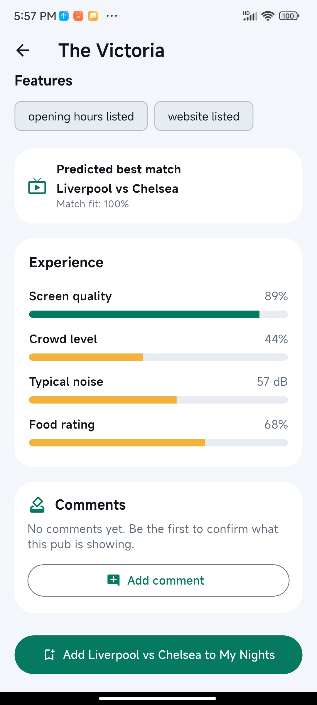
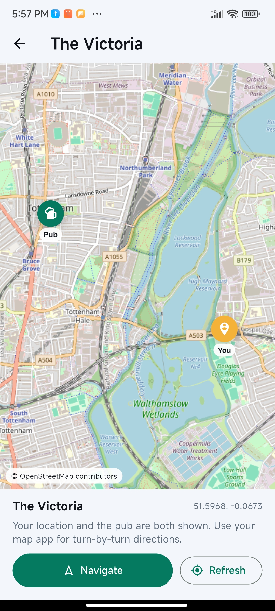
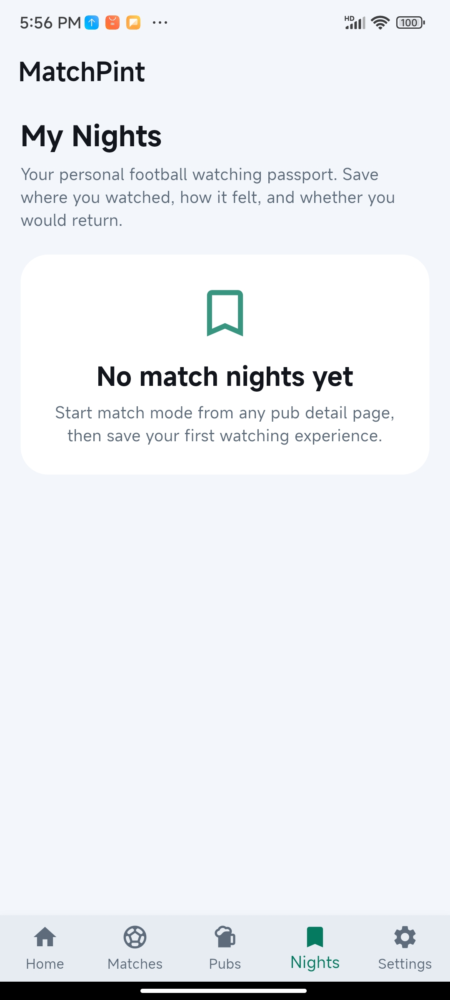
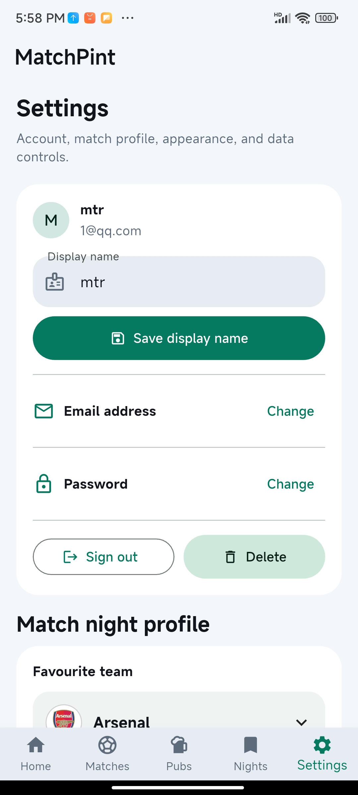

# MatchPint

**MatchPint** is a Flutter mobile application for CASA0015: Mobile Systems and Interactions. It helps football fans plan where to watch live matches by starting with the fixture and then recommending suitable pubs nearby.

The app focuses on a common match-day problem: fans often know which game they want to watch, but they do not know which pub is likely to show it, how the venue feels, or whether it matches the type of football night they want. MatchPint connects fixtures, venue information, location-based discovery, user preferences, pub tags and lightweight match-night feedback into a single mobile experience.

- **Repository:** <https://github.com/minJerrymin/casa0015-mobile-assessment>
- **Landing page:** <https://minjerrymin.github.io/casa0015-mobile-assessment/>
- **Latest APK release:** <https://github.com/minJerrymin/casa0015-mobile-assessment/releases/latest>

---

## Project overview

MatchPint is designed around a fixture-first user journey. Instead of asking users to search for pubs first, the app encourages users to begin with a football match, then compare recommended venues based on proximity, features, map location, comments and match-day suitability.

The project fits the Connected Environments theme by linking the user’s physical context, especially location and nearby urban leisure spaces, with digital information about football fixtures and venue suitability. The app uses mobile interaction patterns including onboarding, bottom navigation, cards, maps, location prompts, detail pages, comments and saved match-night records.

---

## Core features

### Fixture-first discovery

Users can browse upcoming football fixtures and start planning from the match they want to watch. This creates a clearer narrative than a generic venue search because the user journey begins with a real match-day intention.

### Recommended pubs

The app recommends pubs that may be suitable for watching football. Pub cards present concise venue information, feature tags and match-related suitability signals so users can quickly compare options.

### Location-aware pub search

MatchPint can use the phone’s location to rank and refresh nearby pub recommendations. Users can also choose an area manually, which supports users who are planning ahead or checking pubs in a different part of London.

### Pub detail pages

Each pub detail page gives users a focused view of the venue, including map location, tags, match suitability, comments and actions for planning a match night.

### Match mode and saved nights

Users can start a match-night mode, record lightweight experience feedback and save match-night history. This gives the app repeat-use value beyond a single search session.

### Account, preferences and settings

The app includes authentication, onboarding, user preferences, theme settings and account management. Preferences help shape the user experience around the kind of pub atmosphere the user wants.

---

## Screenshots and demo media

The screenshots below are embedded from `docs/screenshots/` so the README and GitHub Pages landing page use the same final app media assets.

| Login and register | Onboarding | Home |
|---|---|---|
|  |  |  |

| Matches | Pub search | Pub detail |
|---|---|---|
|  |  |  |

| Map | Experience record | Settings |
|---|---|---|
|  |  |  |

A short demo video/GIF can be added at:

```text
docs/demo/matchpint-demo.mp4
```

---

## Technical implementation

MatchPint is built with **Flutter** and **Dart**. The app uses a single Flutter codebase and targets Android for the final APK submission.

Main technologies and packages include:

| Technology / package | Use in the app |
|---|---|
| Flutter / Dart | Cross-platform mobile app framework and programming language |
| Material widgets | Core UI layout, navigation, cards, forms and controls |
| Firebase Core | Firebase initialisation |
| Firebase Authentication | Account registration and login support |
| Cloud Firestore | Cloud data support for live/mobile data integration |
| geolocator | Device location and nearby pub discovery |
| flutter_map | Interactive map display |
| latlong2 | Geographic coordinates and distance calculations |
| url_launcher | Opening external map/navigation links |
| record | Lightweight audio/noise-related match-night interaction |
| shared_preferences | Local persistence for settings, onboarding and user state |
| http | Network requests and API/service integration |

---

## Repository structure

```text
lib/                         Flutter/Dart source code
lib/screens/                 App screens and major views
lib/services/                Firebase, location, live data and local storage services
lib/models/                  App data models
lib/data/                    Mock/fallback data
lib/theme/                   App theme definitions
assets/branding/             Logo and brand assets
assets/launcher/             Launcher/splash assets
android/                     Android platform project
docs/                        GitHub Pages landing page
landing/                     Original landing-page source
functions/                   Firebase/backend scaffold
.github/workflows/           GitHub Actions build and release workflow
submission-file.md           CASA0015 submission declaration file
```

---

## How to run locally

### Prerequisites

Install Flutter and Android tooling, then check your setup:

```bash
flutter doctor
```

Accept Android licences if needed:

```bash
flutter doctor --android-licenses
```

### Install dependencies

```bash
flutter pub get
```

### Run on an Android device or emulator

```bash
flutter run
```

---

## How to build the APK manually

From the project root:

```bash
flutter clean
flutter pub get
flutter build apk --release
```

The generated APK will be located at:

```text
build/app/outputs/flutter-apk/app-release.apk
```

A helper script is also provided:

```powershell
powershell -ExecutionPolicy Bypass -File scripts/build_release_apk.ps1 v1.0.2
```

or on macOS/Linux:

```bash
bash scripts/build_release_apk.sh v1.0.2
```

The helper script copies the APK into:

```text
release/MatchPint-v1.0.2.apk
```

The `release/` folder should not be committed to the repository. APK files should be uploaded through GitHub Releases.

---

## GitHub Release workflow

This repository includes a GitHub Actions workflow that builds a release APK when a version tag is pushed.

Create and push a tag:

```bash
git tag v1.0.2
git push origin v1.0.2
```

GitHub Actions will then:

1. Install Flutter
2. Download dependencies
3. Analyse the project
4. Build the Android release APK
5. Upload the APK as a workflow artifact
6. Attach the APK to a GitHub Release

The release will appear here:

<https://github.com/minJerrymin/casa0015-mobile-assessment/releases/latest>

---

## GitHub Pages landing page

The landing page is published from the `docs/` folder through GitHub Pages.

Expected URL:

<https://minjerrymin.github.io/casa0015-mobile-assessment/>

To enable it in GitHub:

```text
Settings → Pages → Deploy from a branch → main → /docs
```

---

## Connected Environments relevance

MatchPint treats the city as a connected match-day environment. It combines mobile location, pub discovery, map-based interaction, live/dynamic fixture information and user-generated experience feedback to support decisions in physical urban spaces. The app is not just a static pub list; it connects digital match information with the user’s movement, preferences and social football-watching context.

---

## Future improvements

With more development time, MatchPint could be extended with:

- Real venue verification through pub owners or community moderation
- More robust live sports fixture APIs
- Crowd-level prediction based on repeated user feedback
- Push notifications for match reminders and pub availability
- Better accessibility testing and screen-reader refinement
- More complete Firebase-backed comment and history synchronisation
- A richer recommendation model based on user behaviour over time

---

## Author

**Tianrui Min**  
CASA0015: Mobile Systems and Interactions  
University College London

---

## Declaration

This repository contains the source code and supporting files for the CASA0015 final mobile application assessment. Where third-party packages, APIs, documentation or tutorials informed the work, these are acknowledged in `submission-file.md` and in the project dependencies.
